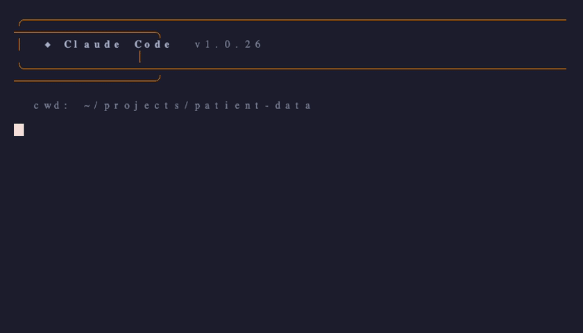
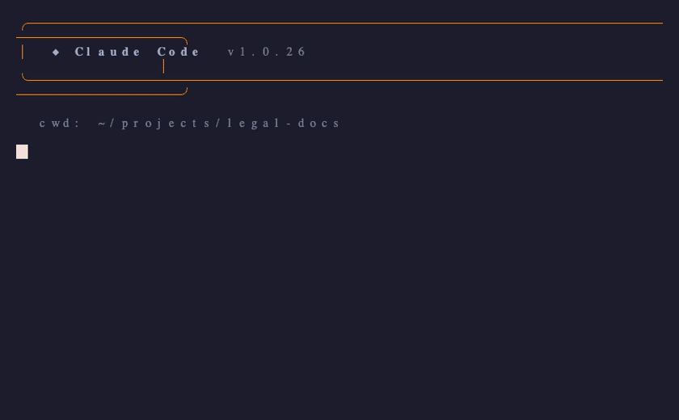
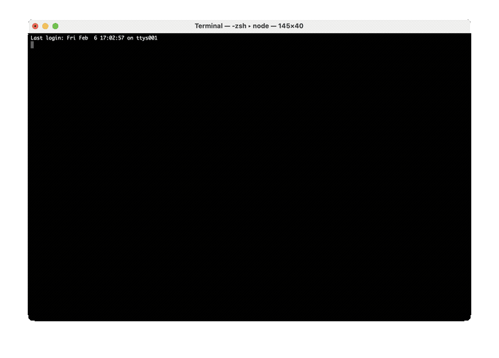

# Nutrient Document Processing — Agent Skill

<p align="center">
  <a href="https://www.nutrient.io/api/"></a>
  <a href="LICENSE"></a>
  <a href="https://agentskills.io"></a>
</p>

<p align="center">
  <strong>Give your AI agent PDF superpowers — in one command.</strong><br>
  Convert, extract, OCR, redact, sign, and fill documents from any coding agent.
</p>

<p align="center">
  
</p>

<p align="center">
  <a href="#30-second-quickstart">Quickstart</a> •
  <a href="#real-world-workflows">Workflows</a> •
  <a href="#features">Features</a> •
  <a href="#supported-agents">40+ Agents</a>
</p>

---

## 30-Second Quickstart

**1. Get a free API key** → **<https://dashboard.nutrient.io/sign_up/?product=processor>**

**2. Install & configure:**

```bash
# Install the skill (works with 40+ agents)
npx skills add PSPDFKit-labs/nutrient-agent-skill

# Set your API key
export NUTRIENT_API_KEY="pdf_live_..."
```

**3. Ask your agent:**

> *"Extract the text from invoice.pdf"*

That's it. Your agent now has full document processing capabilities.

---

## Requirements

- Python 3.10+
- `uv` installed: <https://docs.astral.sh/uv/>
- Nutrient API key

---

## Supported Agents

Works out of the box with **40+ AI coding agents**:

<p align="center">
  
  
  
  
  
  
  
  
  
  
  
</p>

Any agent that supports the [Agent Skills](https://agentskills.io) standard works automatically.

---

## Real-World Workflows

### 🔍 Workflow 1: OCR a scanned document and extract text

You have a scanned PDF — no selectable text. Ask your agent:

> *"OCR scanned-contract.pdf in English and extract the text to a file"*

**What happens:**
```
scanned-contract.pdf (image-only)
  → OCR (English) → searchable-contract.pdf (selectable text)
  → Extract text → contract-text.txt
```



### 📋 Workflow 2: Fill a PDF form and sign it

You have an onboarding form to complete. Ask your agent:

> *"Fill employee-onboarding.pdf with name 'Jane Smith', start date '2026-03-01', and department 'Engineering', then digitally sign it"*

**What happens:**
```
employee-onboarding.pdf (blank form)
  → Fill fields (name, date, department)
  → Digital signature (CMS)
  → employee-onboarding-signed.pdf ✅
```



### 🔒 Workflow 3: Redact PII before sharing

You need to share a document but it contains sensitive data. Ask your agent:

> *"Redact all social security numbers, email addresses, and credit card numbers from patient-records.pdf"*

**What happens:**
```
patient-records.pdf (contains PII)
  → Detect SSNs, emails, credit cards
  → Apply black redaction boxes (irreversible)
  → patient-records-redacted.pdf 🔒
```

> **Tip:** For smarter redaction, try: *"Use AI redaction to find and remove all personally identifiable information from contract.pdf"* — this uses contextual AI analysis instead of pattern matching.

---

## Features

| Capability | Description | Example prompt |
|------------|-------------|----------------|
| 📄 **Convert** | PDF ↔ DOCX/XLSX/PPTX, HTML → PDF, images → PDF | *"Convert report.docx to PDF"* |
| 📝 **Extract** | Text, tables, and key-value pairs from PDFs | *"Extract all tables from invoice.pdf as Excel"* |
| 🔍 **OCR** | Multi-language OCR for scanned documents | *"OCR this German scan and extract the text"* |
| 🔒 **Redact** | Pattern-based + AI-powered PII redaction | *"Redact all SSNs and emails from records.pdf"* |
| 💧 **Watermark** | Text or image watermarks with full styling | *"Add a DRAFT watermark to proposal.pdf"* |
| ✍️ **Sign** | CMS and CAdES digital signatures | *"Digitally sign contract.pdf"* |
| 📋 **Fill Forms** | Programmatic PDF form filling | *"Fill the tax form with these values…"* |
| 📊 **Credits** | Monitor API usage and balance | *"How many API credits do I have left?"* |

---

## Installation

### Using `npx skills` (Recommended)

```bash
# Install to all detected agents
npx skills add PSPDFKit-labs/nutrient-agent-skill

# Install to specific agents only
npx skills add PSPDFKit-labs/nutrient-agent-skill -a claude-code -a codex -a cursor

# Install globally (available across all projects)
npx skills add PSPDFKit-labs/nutrient-agent-skill -g
```

### Manual Installation

Copy the `nutrient-document-processing/` folder to your agent's skills directory:

| Agent | Project Path | Global Path |
|-------|-------------|-------------|
| **Claude Code** | `.claude/skills/` | `~/.claude/skills/` |
| **Codex CLI** | `.codex/skills/` | `~/.codex/skills/` |
| **Gemini CLI** | `.gemini/skills/` | `~/.gemini/skills/` |
| **Cursor** | `.cursor/skills/` | `~/.cursor/skills/` |
| **GitHub Copilot** | `.github/skills/` | `~/.copilot/skills/` |
| **OpenCode** | `.opencode/skills/` | `~/.config/opencode/skills/` |
| **Windsurf** | `.windsurf/skills/` | `~/.codeium/windsurf/skills/` |
| **Amp** | `.agents/skills/` | `~/.config/agents/skills/` |
| **OpenClaw** | `skills/` | `~/.moltbot/skills/` |
| **Roo Code** | `.roo/skills/` | `~/.roo/skills/` |

Example for Claude Code:

```bash
git clone https://github.com/PSPDFKit-labs/nutrient-agent-skill.git
cp -r nutrient-agent-skill/nutrient-document-processing ~/.claude/skills/
```

---

## Skill Structure

```
nutrient-document-processing/
├── SKILL.md                          # Main instructions (loaded by agents)
├── scripts/
│   ├── *.py                          # Single-operation scripts
│   └── lib/common.py                 # Shared utilities
├── assets/
│   └── templates/
│       └── custom-workflow-template.py  # Runtime pipeline template
├── tests/
│   └── testing-guide.md
└── LICENSE                           # Apache-2.0
```

### Script Model

- `scripts/*.py` are single-operation scripts only.
- Multi-step workflows are generated at runtime in a temporary script from `assets/templates/custom-workflow-template.py`.
- Do not commit runtime pipeline scripts.

## Documentation

- **[SKILL.md](nutrient-document-processing/SKILL.md)** — Agent instructions with setup and operation examples
- **[Testing Guide](nutrient-document-processing/tests/testing-guide.md)** — Manual test procedures
- **[Custom Workflow Template](nutrient-document-processing/assets/templates/custom-workflow-template.py)** — Runtime pipeline starting point
- **[API Playground](https://dashboard.nutrient.io/processor-api/playground/)** — Interactive API testing
- **[Official API Docs](https://www.nutrient.io/guides/dws-processor/)** — Nutrient documentation

## About

Built by [Nutrient](https://www.nutrient.io/) (formerly PSPDFKit) — document SDKs trusted by thousands of companies worldwide.

## License

[Apache-2.0](nutrient-document-processing/LICENSE)
